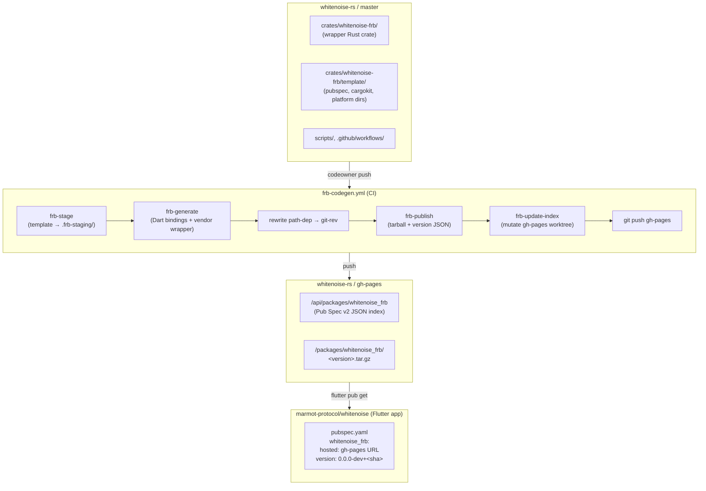

# Flutter Rust Bridge — published as a hosted pub package

## What this is

`whitenoise-rs` owns the Flutter Rust Bridge wrapper at
`crates/whitenoise-frb/` and publishes a Dart pub package
(`whitenoise_frb`) to a static pub registry served from this repo's
`gh-pages` branch. The Flutter app consumes it via a standard `hosted:`
pubspec source. No codegen runs on the Flutter side, and no orphan
branch participates in the flow.

## Architecture



## Where things live

### On `master`

| Concern | Path |
|---|---|
| FRB wrapper crate | `crates/whitenoise-frb/` |
| Package template (pubspec, cargokit, platform glue) | `crates/whitenoise-frb/template/` |
| FRB config | `flutter_rust_bridge.yaml` |
| Codegen + publish scripts | `scripts/frb-{stage,generate,check,publish,update-index,pages-bootstrap}.sh` |
| CI workflow | `.github/workflows/frb-codegen.yml` |
| Local staging directory | `.frb-staging/` (gitignored) |

### On `gh-pages`

| Concern | Path |
|---|---|
| Pub Spec v2 index | `/api/packages/whitenoise_frb` |
| Tarballs | `/packages/whitenoise_frb/<version>.tar.gz` |
| Jekyll-disable marker | `/.nojekyll` |
| Landing page (human-friendly) | `/index.html` |

Public URL: `https://marmot-protocol.github.io/whitenoise-rs/`

## Versioning

Each codeowner push to `master` publishes a single version of the form:

```
0.0.0-dev+<short-sha>
```

(e.g. `0.0.0-dev+a1b2c3d`). Per semver, build metadata after `+` is not
part of version precedence — every published version has the same
`0.0.0-dev` precedence. **Consumers must pin a specific SHA**;
`version: any` resolves arbitrarily across `0.0.0-dev+*` versions and is
not supported.

CI retains the most recent 20 dev versions on `gh-pages`; older tarballs
are pruned on each publish.

## Local development

```sh
# 1. Populate .frb-staging/ from the vendored template
just frb-stage

# 2. Run codegen — writes Dart into .frb-staging/lib/src/rust/ and
#    vendors crates/whitenoise-frb/ into .frb-staging/rust/
just frb-generate

# 3. Lint the wrapper crate
just frb-check

# 4. (optional) Build a tarball + version JSON for inspection. Writes to
#    /tmp/frb-publish-out/. Does NOT push anything.
just frb-publish-local
```

The codegen tool must match the `flutter_rust_bridge` crate version
pinned in `crates/whitenoise-frb/Cargo.toml` (`2.11.1`):

```sh
cargo install flutter_rust_bridge_codegen --version 2.11.1 --locked
```

## CI workflow

`.github/workflows/frb-codegen.yml`:

1. **Gate** — parses the wildcard rule from `.github/CODEOWNERS` at
   runtime and verifies `github.actor` is one of those user logins.
   Non-codeowner pushes skip cleanly. Team entries (`org/team`) cause
   the gate to fail fast (user-login matching can't resolve them).
2. **Publish**:
   - Checkout source at the pushed SHA
   - Checkout `gh-pages` into a sibling worktree
   - Install Rust 1.90.0, `flutter_rust_bridge_codegen` 2.11.1, Flutter SDK
   - Stage from template (`scripts/frb-stage.sh`)
   - Run codegen (`scripts/frb-generate.sh`)
   - Lint wrapper (`scripts/frb-check.sh`)
   - Rewrite `whitenoise = { path = "../.." }` in the vendored
     `rust/Cargo.toml` to a git rev pinning the source SHA
   - Write `REGENERATED.txt` provenance marker
   - Build tarball + version JSON (`scripts/frb-publish.sh`)
   - Mutate gh-pages worktree (`scripts/frb-update-index.sh`)
   - Commit + push gh-pages

Concurrency: `group: frb-publish, cancel-in-progress: false` — queues
rather than cancels, since dropping a publish would leave gh-pages
out-of-sync with master.

Auth: same extraheader pattern used elsewhere — never embeds the token
in the remote URL.

## One-time bootstrap

The `gh-pages` branch must exist and GitHub Pages must be serving from
it before the workflow can publish.

```sh
# 1. Create the gh-pages orphan branch with .nojekyll + landing page
PUB_BASE_URL="https://marmot-protocol.github.io/whitenoise-rs" \
    bash scripts/frb-pages-bootstrap.sh

# 2. Push the bootstrap commit
git -C .gh-pages-bootstrap push origin gh-pages

# 3. Enable GitHub Pages serving:
#    Settings → Pages → Source = gh-pages branch / (root)

# 4. Verify the landing page is live (takes ~1 min after enabling Pages)
curl https://marmot-protocol.github.io/whitenoise-rs/

# 5. Clean up the local worktree
git worktree remove .gh-pages-bootstrap
```

The bootstrap script is idempotent: if `origin/gh-pages` already exists,
it no-ops with a pointer to the Pages settings URL.

## Migration sequence

Strict ordering — each step depends on the previous one being live.

1. **Bootstrap `gh-pages`** (one-time, see above).
2. **Land this PR** on `marmot-protocol/whitenoise-rs`. The new workflow
   replaces the old orphan-branch flow.
3. **Verify the first publish lands** on `gh-pages`:
   - Check the workflow run succeeds
   - Confirm the index: `curl https://marmot-protocol.github.io/whitenoise-rs/api/packages/whitenoise_frb`
   - Confirm at least one tarball under `/packages/whitenoise_frb/`
4. **Land the Flutter cutover PR** on `marmot-protocol/whitenoise`
   (see checklist below).
5. **Verify the Flutter app builds** against the hosted package source.
6. **Delete the `flutter-package` orphan branch**:
   ```sh
   git push origin --delete flutter-package
   ```

Deleting the orphan branch before step 5 will break `flutter pub get`
on the Flutter app's main branch. The deletion is the terminal step.

## Flutter app cutover checklist

For the PR on `marmot-protocol/whitenoise`:

1. **Remove the in-repo wrapper and build glue:**
   - `rust/` (wrapper crate)
   - `rust_builder/` (cargokit + plugin shape)
   - `flutter_rust_bridge.yaml`
   - `lib/src/rust/` (auto-generated Dart — will come from the hosted
     package)

2. **Update `pubspec.yaml`** — switch from `git:` to `hosted:`:

   ```yaml
   dependencies:
     whitenoise_frb:
       hosted: https://marmot-protocol.github.io/whitenoise-rs
       version: "0.0.0-dev+<short-sha>"   # pin a specific master SHA
   # flutter_rust_bridge is pulled in transitively from whitenoise_frb;
   # remove the top-level entry if it was pinned.
   ```

   Get the latest SHA from
   `https://marmot-protocol.github.io/whitenoise-rs/api/packages/whitenoise_frb`
   (the `latest.version` field).

3. **Rewrite Dart imports** across the app:

   ```sh
   find lib test -name "*.dart" -exec \
     sed -i 's#package:whitenoise/src/rust#package:whitenoise_frb/src/rust#g' {} +
   ```

4. **Remove generation recipes** from `justfile`: `generate`,
   `regenerate`, `clean-bridge`, and any `lint-rust` / `test-rust`
   recipes that operated on the deleted `rust/`.

5. **Update `analysis_options.yaml`** — drop the `rust_builder/**`
   exclude.

6. **Update docs** (`AGENTS.md`, `CONTRIBUTING.md`) — remove the
   "run `just generate` locally" instructions.

7. **Test**: `flutter pub get && flutter build` (per relevant platforms).

After this PR lands and the app builds successfully, return to the
whitenoise-rs migration sequence and run the orphan-branch deletion
(step 6 above).

## Codeowner gating

The CI workflow derives the allowlist from `.github/CODEOWNERS` at
runtime (parsing the wildcard rule). `github.actor` is matched against
the parsed user logins, so the gate stays in sync with the file
automatically. Team entries (`org/team`) cause the gate to fail fast —
extend the workflow to query the GitHub Teams API if you need that.
Non-codeowner pushes to master skip the publish job silently.

## Known risk: extensionless JSON MIME type

GitHub Pages serves `/api/packages/whitenoise_frb` (no file extension)
as `application/octet-stream`, not the spec-mandated
`application/vnd.pub.v2+json`. Most pub clients parse the JSON
regardless of the declared content-type, so this is expected to work,
but spec-strict clients may reject. Verify on first publish.

If clients reject the MIME type, options:
- Place a small Cloudflare Worker in front of Pages to set the header
- Switch the index to a different static host that supports
  `_headers` / route overrides
